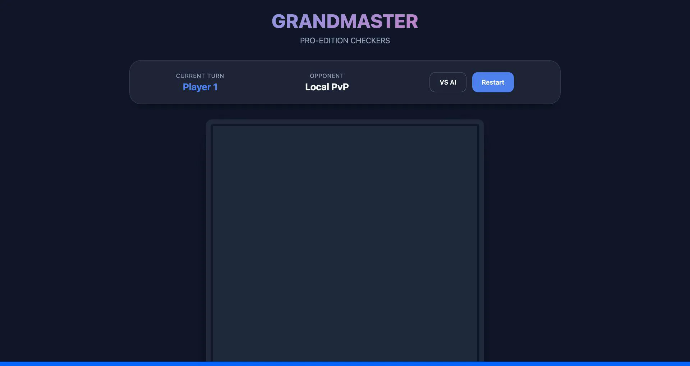

# 🏁 Grandmaster Checkers

A complete, production-ready Checkers (Draughts) game built with Vanilla HTML, CSS, and JavaScript. Featuring a sleek modern UI and a strategic Minimax AI.



## 🚀 Live Demo
Play the game live: [https://alfredang.github.io/checker-game/](https://alfredang.github.io/checker-game/)

> [!IMPORTANT]
> To enable the live demo, go to your repository **Settings > Pages** and under **Build and deployment > Source**, select **"GitHub Actions"**.

---

## 🛠 Features
- **Modern UI**: Dark theme with glassmorphism, responsive design, and smooth animations.
- **Smart AI**: Multi-level AI: 
  - **Easy**: Random moves for casual play.
  - **Master**: Minimax algorithm with Alpha-Beta pruning (Depth 4).
- **Rule Enforcement**: Standard Draughts rules including forced jumps and multi-jump sequences.
- **Sound Effects**: Dynamic audio feedback for moves and captures.

---

## 📦 Installation & Setup

### 1️⃣ Local Setup
Simply clone the repository and open `index.html` in your browser.
```bash
git clone https://github.com/alfredang/checker-game.git
cd checker-game
open index.html
```

### 2️⃣ Docker (Local)
Build and run the game using Docker:
```bash
# Build the image
docker build -t checker-game .

# Run the container
docker run -d -p 8080:80 checker-game
```
Then visit `http://localhost:8080`.

### 3️⃣ Docker Hub
Pull the pre-built image from Docker Hub:
```bash
docker pull alfredang/checker-game:latest
docker run -d -p 8080:80 alfredang/checker-game:latest
```

---

## 💻 Tech Stack
- **HTML5**: Semantic structure.
- **CSS3**: Modern layouts, HSL colors, and animations.
- **JavaScript**: Modular logic, Minimax AI implementation, and Web Audio API.

## 📜 Rules
1. Pieces move diagonally on dark squares.
2. If a jump is available, it **must** be taken (Forced Capture).
3. If a piece can jump again after a capture, it must continue the sequence.
4. Pieces are promoted to Kings when they reach the opposite end. Kings can move and jump backwards.

---

Built with ❤️ by [Alfred Ang](https://github.com/alfredang)
